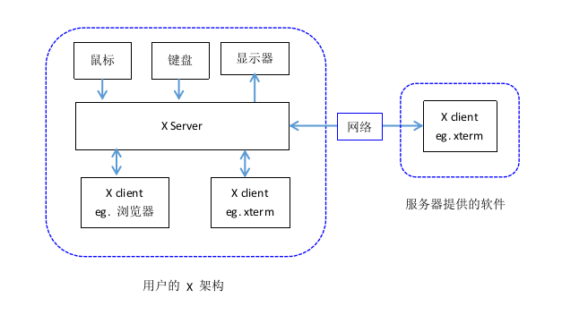

----

GTK and Qt are user interface toolkits and frameworks. They are **libraries** that the developers use to design graphical interfaces. 需要各自设置主题

https://unix.stackexchange.com/questions/129355/what-is-difference-between-gtk-and-qt-applications


GNOME is a desktop environment that uses GTK+ as its GUI toolkit. KDE is another desktop environment. It's more like Windows in general style and uses Qt as its GUI toolkit.
[ref](https://askubuntu.com/questions/249150/what-is-kde-gtk-gtk-qt-and-or-gnome)

----


## [X, X11, X server, X client, Xorg](http://cn.linux.vbird.org/linux_basic/0590xwindow.php#xwin)
1. X: **X window system**
	* **提供图形界面**，否则只是tty，不是系统，是一个 **协议**
	* 有时也指 [**Xorg**](https://wiki.archlinux.org/index.php/Xorg_(简体中文))
	* 特点：
		+ Server/Client 网络模型
2. X11: X通信协议的第11版本
	* 现在的版本是 X11R7.7，由Xorg基金会维护。
	* Qt, GTK 基于此
3. X server: 基于X11 协议的 **服务端**。
	* 管理硬件设备（驱动），键盘鼠标显示器等。
4. X client:
	* 基于X11 协议的客户端，具体就是各种各样的 **图形软件**。
5. Xorg: 一种 **X server**
	* 有时也称为X

### X server 和 X client 关系

注意图中鼠标，键盘和显示器的箭头方向
* X server
	+ 将输入设备的信息（鼠标动作，键盘输入）发送给X client
	+ 将X client发送回来的显示信息输入到显示器上。
* X client: 处理X server 发送过来的数据，并对其运算，发送给X server 显示信息。

以`xeyes`(跟踪鼠标位置)为例：
1. 鼠标发送给电脑 移动 的信息。
2. `xorg` 读取这个信息。(???驱动)并把光标的位置信息发送给`xeyes`
3. `xeyes`读取这个光标信息，并计算黑圆（“眼黑”）位置，并把位置信息发送给 `xorg`。
4. `xorg` 把位置信息画在屏幕上。

在远程通信中，这里和http协议上有些不一样，X server是在本地，因为它和硬件相关，client 可以在在本地，也可以在远端，它就是一个提供服务的软件。

但gtk 和 qt 开发的程序不能启动???


## others
1. X window manager
	窗口管理器，是一个特殊的 X Client ，负责管理所有的 X client 软件
2. X session
	是指X server启动后直到X server关闭之间的这段时间。这期间一切跟X相关的动作都属于Xsession的内容。管理X session的程序称为DisplayManager，常听说的gdm或kdm就是gnome/kde所分别对应的Display Manager。 


* X: X Window System(X視窗 **系統**)
* X11: X視窗系統 的最新 **标准**
* xorg: X11的一個最廣爲使用的 **實現**
* x server是X標準/協議的一部分（很可能x session也是）
	+ X11的規範中，圖形界面被設計爲Client-Server結構（經提醒，X的C/S結構和HTTP/WWW之類的C/S在表象上有區別【但接受了它的設定以後，其實是一回事】）：其中x server負責輸出（給顯卡）、接收鍵盤/鼠標的原始輸入等；而每個工作在x上的應用程序是一個x client，x server在接收到輸入後會將輸入發送到對應的x client。（另請見評論第一條。）
* x section: 一個x session代表了你某次啓動的X上的（可見和不可見的）所有東西；
* xinit是X的一個工具/軟件。它的功能就是啓動一個x server及啓動一個x client（

* DM WM DE (略)

./wm_de_dm.md


## `Xorg.conf`
### what is Identifier
[link](https://superuser.com/questions/1014502/how-to-find-the-identifier-value-for-an-xorg-conf-device-graphics-card-secti)

```sh
 X :1 -configure
 # /root/xorg.conf.new
```

The Identifier is a name that you give the Device. It is not evaluated by Xorg, *it is only used when you want to refer to that Device in any other Section, like Monitor or Screen.* For Devices that have no section in xorg.conf, *Xorg self-assigns names*, as you found out, starting with Card0. If you had two graphics cards, it would use Card1 for the second one.

### xorg.conf
```conf
Section "ServerLayout"
  Identifier "layout"
  Screen 0 "iGPU" # Device below
  Option "AllowNVIDIAGPUScreens"
EndSection

Section "Device"
  Identifier "iGPU"
  Driver "modesetting"
  BusID "PCI:0:2:0"
EndSection

Section "Screen"
  Identifier "iGPU"
  Device "iGPU"
EndSection

Section "Device"
  Identifier "dGPU"
  Driver "nvidia"
EndSection
```


---
---

