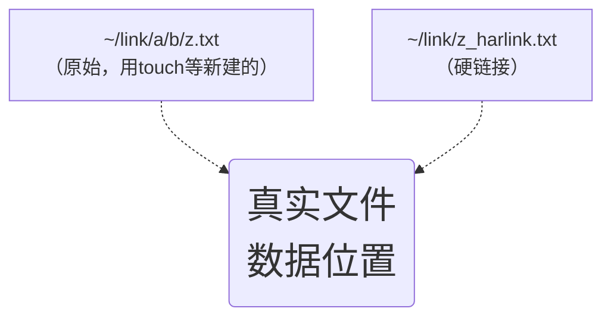
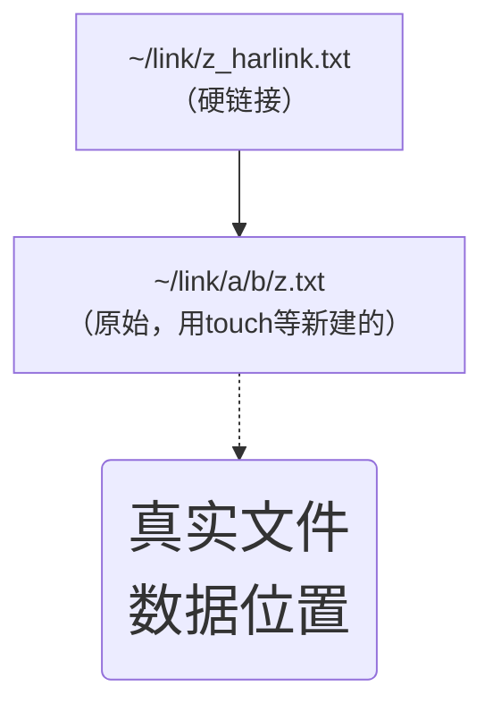

# ln

`sudo ln -s 源目录 目标快捷方式`
比如你要在/etc下面建立一个叫LXBC553的快捷方式，指向/home/LXBC，那就是
`sudo ln -s /home/LXBC /etc/LXBC553`


删除快捷方式：

```
# 删除软连接文件
rm -rf   symbolic_name 

# 删除软连接和真实数据
rm -rf   symbolic_name/
```


也可以用`unlink symbolic_name` 来删除快捷方式

---
# 链接 (link)
## 硬链接 (hard link) :
硬链接可以用作备份文件，但不可跨硬盘链接。
### &emsp;图示

### &emsp;命令
```sh
cp -l [source file] [destination file]
#or
ln [source file] [destination file]
```

## 符号链接 (symbolic link)<font size =1>(不是软链接哦)</font>
即“快捷方式”
符号连接可以跨硬盘建链接，但不能用作备份，原始文件("~ /link/a/b/z.txt")被删除后，链接("~/link/a/b/z.txt")无用了。
### &emsp;图示

### &emsp;命令
```sh
cp -s [source file] [destination file]
#or
ln -s [source file] [destination file]
```

